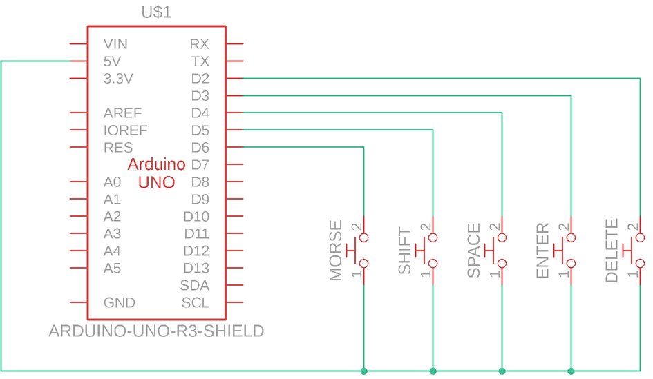

# Morse Keyboard

Ever felt like writing code with 2 hands was too difficult?
With this keyboard, you can write Python code using a modified version of morse code.

## Getting Started

Build and run this code using Arduino IDE

## Circuit Drawing

This is a sample circuit for the keyboard.
There are five buttons from left to right:
- Morse input
- Shift key
- Space key
- Enter key
- Delete key

## Modified Morse Code

Here is a cheat sheet for the Morse code:

